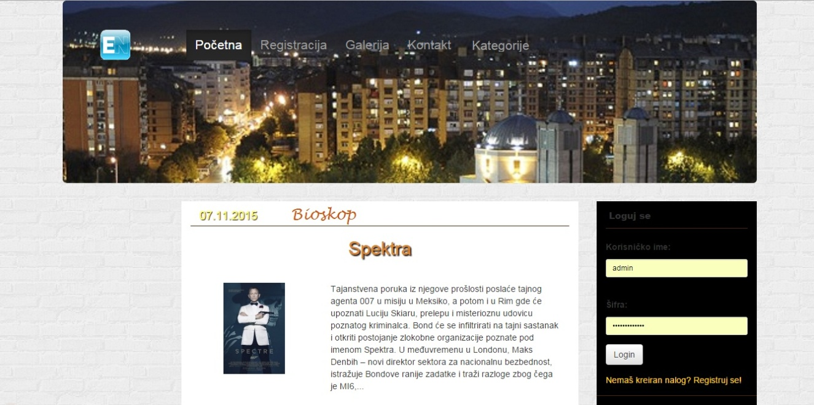

Pocetna strana

### Apache Setup

To setup apache, setup a virtual host to point to the public/ directory of the
project and you should be ready to go! It should look something like below:

    <VirtualHost *:80>
        ServerName zf2-tutorial.localhost
        DocumentRoot /path/to/zf2-tutorial/public
        SetEnv APPLICATION_ENV "development"
        <Directory /path/to/zf2-tutorial/public>
            DirectoryIndex index.php
            AllowOverride All
            Order allow,deny
            Allow from all
        </Directory>
    </VirtualHost>
